# 🏥 Enterprise AI Medical Assistant Platform

<p align="center">
  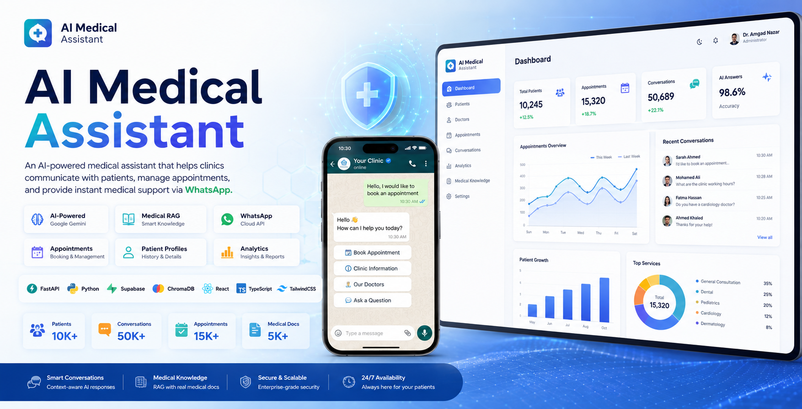
</p>

<p align="center">


</p>

---

# Enterprise AI Medical Assistant Platform

An enterprise-grade AI-powered medical assistant that enables hospitals and clinics to communicate with patients directly through **WhatsApp** using the official **Meta WhatsApp Cloud API**.

The platform combines **Large Language Models (Google Gemini)**, **Retrieval-Augmented Generation (RAG)**, **semantic search**, **patient profile extraction**, **conversation memory**, and **clinic business logic** to provide an intelligent virtual medical receptionist capable of handling patient conversations, answering medical questions, managing clinic information, and assisting with appointment booking.

Unlike typical chatbot projects, this system separates **AI reasoning** from **business logic**, ensuring that medical workflows remain deterministic, secure, and production-ready.

---

# Table of Contents

- Project Overview
- Key Features
- Technology Stack
- Why This Project
- Project Architecture
- Database Design
- Backend Modules
- AI Pipeline
- System Sequence Diagram
- Conversation Workflow
- RAG Pipeline
- AI Components
- Dashboard Features
- Installation
- API Documentation
- Screenshots
- Current Capabilities
- Roadmap
- Contributing
- License


# Project Overview

The platform consists of two major applications:

- 🧠 AI Backend
- 💻 Hospital Administration Dashboard

The backend powers the AI assistant, WhatsApp communication, RAG pipeline, database operations, and clinic business logic.

The Dashboard provides hospital administrators with complete control over patients, appointments, conversations, analytics, AI settings, medical knowledge, and system configuration.

---

# Key Features

## 🤖 AI Medical Assistant

- Google Gemini integration
- Retrieval-Augmented Generation (RAG)
- Medical document search
- Semantic search
- Medical question answering
- Context-aware conversations
- Conversation memory
- Structured response validation

---

## 💬 WhatsApp Integration

- Official Meta WhatsApp Cloud API
- Webhook handling
- Interactive Buttons
- Interactive Lists
- Dynamic Menus
- Quick Replies
- Conversation State Machine

---

## 🏥 Clinic Management

- Clinic information
- Doctors
- Specialties
- Services
- Branches
- Working hours
- Pricing
- Contact information

---

## 👤 Patient Management

- Patient profiles
- Automatic profile extraction
- Conversation history
- Medical history
- Contact information
- Patient details

---

## 📅 Appointment Management

- Appointment booking
- Appointment availability
- Appointment history
- Patient appointments
- Booking workflow
- Business rule validation

---

## 📚 Medical Knowledge Base

- PDF ingestion
- Medical document indexing
- ChromaDB vector database
- Sentence Transformers embeddings
- Context retrieval
- Knowledge search

---

## 📊 Analytics

- Dashboard KPIs
- Conversation statistics
- Patient growth
- Appointment analytics
- Doctor performance
- AI usage statistics

---

## ⚙️ Administration Dashboard

- Modern React dashboard
- Dark / Light mode
- Responsive UI
- Data tables
- Charts
- Settings management
- Medical knowledge management
- AI configuration
- WhatsApp configuration

---

# Technology Stack

| Category | Technologies |
|-----------|--------------|
| Backend | Python 3.13, FastAPI |
| Frontend | React, TypeScript, Vite |
| AI | Google Gemini |
| Embeddings | Sentence Transformers |
| Vector Database | ChromaDB |
| Database | Supabase PostgreSQL + ChromaDB |
| Messaging | Meta WhatsApp Cloud API |
| Styling | TailwindCSS, shadcn/ui |
| Charts | Recharts |
| State Management | TanStack Query |
| Validation | Pydantic, Zod |
| HTTP Client | Axios |
| ORM / Database Client | Supabase Python SDK |

---

# Why This Project?

Traditional chatbot systems rely almost entirely on an LLM for every user request.

This platform follows a different architecture.

Instead of allowing the AI model to make business decisions, the backend acts as the primary decision engine.

The AI is only used when reasoning or medical understanding is required.

This approach provides:

- Faster responses
- Lower AI costs
- Better reliability
- Deterministic business logic
- Production-ready architecture
- Reduced hallucinations

Most user requests never reach the LLM.

Instead, they are handled directly by backend services using clinic data and predefined workflows.

# Architecture Principles

The platform was designed around several engineering principles:

- Feature-based modular architecture
- Clear separation between AI and business logic
- Deterministic backend workflows
- AI used only when reasoning is required
- Production-ready REST APIs
- Scalable multi-module design
- Clean dependency boundaries
- Extensible AI pipeline
- Future multi-clinic support

# Project Architecture

The project follows a modular, feature-based architecture designed for scalability and long-term maintainability.

<p align="center">
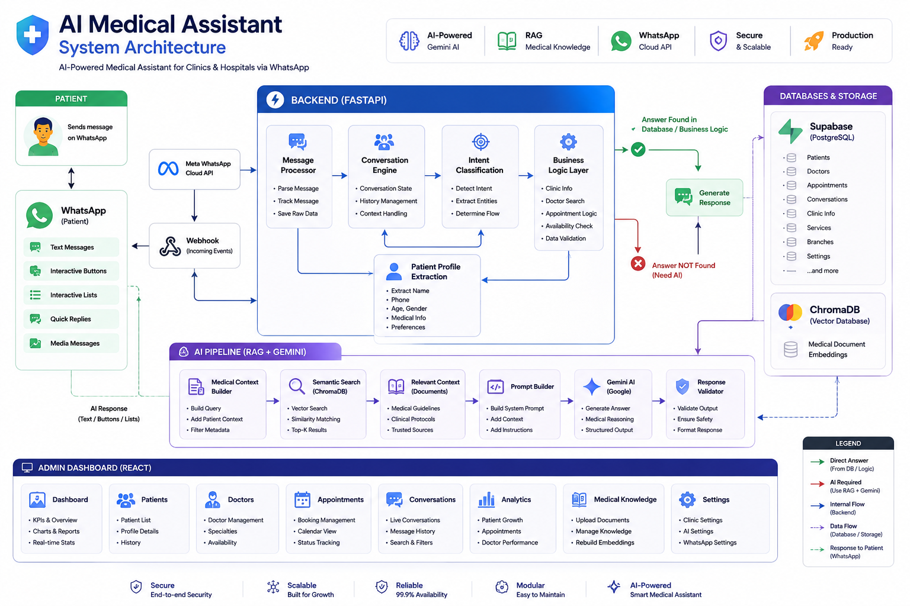
</p>

```
AI-Medical-Assistant/

│
├── backend/
│   │
│   ├── app/
│   │
│   ├── api/
│   │      REST API Endpoints
│   │
│   ├── core/
│   │      Configuration
│   │
│   └── modules/
│
│          ai/
│          analytics/
│          appointments/
│          clinic/
│          conversation/
│          conversation_state/
│          conversations/
│          dashboard/
│          database/
│          intent/
│          interactive/
│          knowledge/
│          message_tracker/
│          patient_details/
│          profile/
│          rag/
│          settings/
│          whatsapp/
│
│
├── dashboard/
│
│      React + TypeScript
│
│      Features
│          Dashboard
│          Patients
│          Doctors
│          Conversations
│          Analytics
│          Settings
│          Medical Knowledge
│
│
├── docs/
│
└── README.md
```

---

## Repository Structure

| Folder | Description |
|---------|-------------|
| backend | FastAPI backend application |
| dashboard | React administration dashboard |
| docs | Documentation and screenshots |
| backend/app/modules | Feature modules |
| backend/knowledge | Medical knowledge base |
| backend/chromadb | Vector database |

# Database Design

The platform uses PostgreSQL (Supabase) with a relational database designed for production healthcare workflows.

Main entities include:

- Clinics
- Branches
- Departments
- Doctors
- Patients
- Conversations
- Appointments
- Appointment Slots
- Services
- Offers
- AI Settings
- System Settings
- Processed Messages

<p align="center">
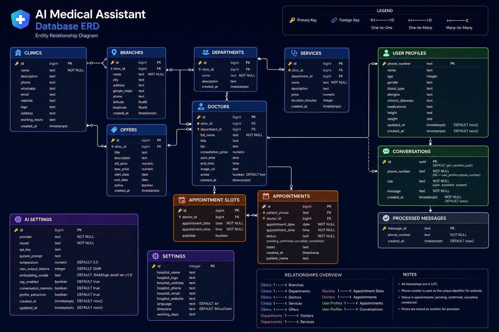
</p>

---

# Backend Modules

The backend is divided into independent feature modules.

| Module | Description |
|---------|-------------|
| AI | AI orchestration and Gemini integration |
| RAG | Retrieval-Augmented Generation pipeline |
| WhatsApp | WhatsApp Cloud API integration |
| Conversation | Conversation processing |
| Conversation State | Conversation workflow management |
| Profile | Patient profile extraction |
| Intent | Intent classification |
| Clinic | Clinic information |
| Appointments | Appointment management |
| Patients | Patient records |
| Analytics | Dashboard analytics |
| Knowledge | Medical document management |
| Interactive | WhatsApp buttons & lists |
| Dashboard | Dashboard APIs |
| Settings | System settings |

---

# AI Pipeline

The AI pipeline is designed to minimize unnecessary LLM usage.

```
Patient

↓

WhatsApp

↓

Webhook

↓

Message Parser

↓

Conversation Processor

↓

Intent Classifier

↓

Business Logic

↓

───────────────

If Backend Knows Answer

↓

Reply

───────────────

Else

↓

Medical Context Builder

↓

Semantic Search

↓

ChromaDB

↓

Relevant Documents

↓

Prompt Builder

↓

Gemini AI

↓

Response Validator

↓

Patient
```

---

# AI Decision Engine

Unlike conventional chatbots, the assistant does not immediately invoke an LLM.

The backend first determines whether the request can be answered using deterministic logic.

Decision order:

```text
Incoming Message

↓

Intent Classification

↓

Backend Knowledge?

↓

YES → Backend Response

↓

NO

↓

RAG Search

↓

Relevant Context Found?

↓

YES → Gemini

↓

NO

↓

Fallback Prompt

↓

Validated Response
```

# System Sequence Diagram

The following diagram illustrates how a WhatsApp message flows through the system.

<p align="center">
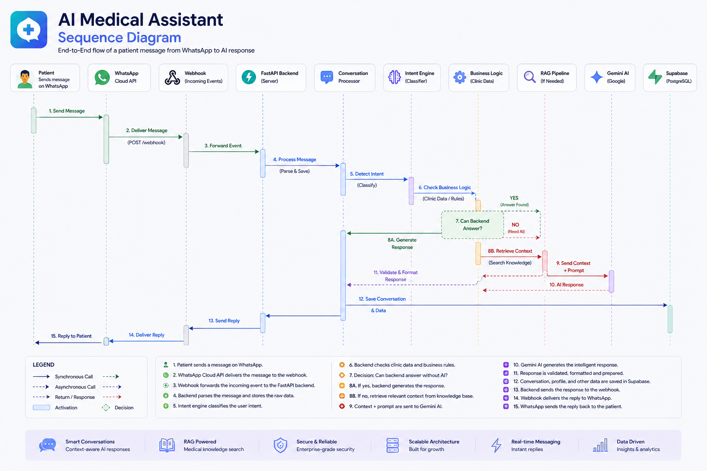
</p>

---

# Conversation Workflow

```
Patient sends message

↓

WhatsApp Webhook

↓

Message Parser

↓

Conversation State

↓

Intent Detection

↓

Profile Extraction

↓

Business Logic

↓

Appointment Logic

↓

Clinic Knowledge

↓

Medical RAG

↓

Gemini (if required)

↓

Response Validation

↓

WhatsApp Reply
```

---

# RAG Pipeline

The Retrieval-Augmented Generation pipeline consists of multiple stages.

```
Medical PDFs

↓

Text Extraction

↓

Cleaning

↓

Chunking

↓

Embeddings

↓

ChromaDB

↓

Similarity Search

↓

Relevant Context

↓

Gemini

↓

Medical Answer
```

---

# AI Components

The AI module contains several specialized components.

| Component | Responsibility |
|------------|----------------|
| Assistant | Main AI orchestrator |
| Prompt Builder | Prompt generation |
| Gemini Service | Gemini communication |
| Context Builder | Medical context generation |
| Profile Formatter | Patient profile formatting |
| Response Parser | Structured output parsing |
| Response Validator | AI response validation |
| Repository | AI persistence |

---

# WhatsApp Features

The system supports the official Meta WhatsApp Cloud API.

Supported capabilities include:

- Text messages

- Interactive buttons

- Interactive lists

- Reply buttons

- Dynamic menus

- Webhook events

- Conversation tracking

- Button callbacks

- List callbacks

- Delivery status

- Read receipts

---

# Dashboard Features

The administration dashboard includes multiple management panels.

## Dashboard

- KPIs
- Appointment overview
- Patient growth
- Recent conversations
- Daily appointments

---

## Patients

- Patient table
- Search
- Filters
- Patient profile
- Appointment history
- Conversation history

---

## Doctors

- Doctor management
- Availability
- Specialties
- Booking statistics

---

## Conversations

- Live conversations
- Patient messages
- AI responses
- Conversation timeline

---

## Analytics

- Patient growth
- Appointment trends
- Doctor bookings
- AI statistics
- Conversation analytics

---

## Medical Knowledge

- Upload PDFs
- View documents
- Delete documents
- Rebuild embeddings

---

## Settings

- Clinic settings
- AI configuration
- WhatsApp configuration
- Database configuration
- Backup settings
- Danger Zone

---

# Security

The platform follows several security practices:

- Environment-based secret management
- API key isolation
- Server-side business validation
- Webhook verification
- Conversation tracking
- Duplicate message protection
- Input validation using Pydantic
- Secure database access through Supabase

# Installation

## Clone the Repository

```bash
git clone https://github.com/amgadnazar/AI-Medical-Assistant.git

cd AI-Medical-Assistant
```

---

# Backend Setup

Navigate to the backend directory.

```bash
cd backend
```

Install the dependencies using **uv**.

```bash
uv sync
```

Or using pip

```bash
pip install -r requirements.txt
```

---

# Configure Environment Variables

Create a new environment file.

```bash
cp .env.example .env
```

Fill the required variables.

Example:

```env
GEMINI_API_KEY=

SUPABASE_URL=

SUPABASE_KEY=

WHATSAPP_ACCESS_TOKEN=

WHATSAPP_PHONE_NUMBER_ID=

WHATSAPP_VERIFY_TOKEN=

MODEL_NAME=gemini-2.5-pro

EMBEDDING_MODEL=sentence-transformers/all-MiniLM-L6-v2
```

---

# Run Backend

Using uv

```bash
uv run uvicorn app.main:app --reload
```

or

```bash
uvicorn app.main:app --reload
```

The backend will be available at

```
http://localhost:8000
```

---

# Dashboard Setup

Open a second terminal.

```bash
cd dashboard
```

Install dependencies.

```bash
npm install
```

Run development server.

```bash
npm run dev
```

Dashboard URL

```
http://localhost:5173
```

---

# Medical Knowledge Base

Medical documents are stored inside

```
backend/knowledge/
```

Supported formats include

- PDF

- Medical Guidelines

- Clinical Protocols

- Research Papers

---

# Generate Embeddings

After adding new medical documents, rebuild the vector database.

```bash
cd backend

python ingest.py
```

The system automatically

- extracts text

- cleans content

- creates chunks

- generates embeddings

- stores vectors in ChromaDB

---

# Configure WhatsApp Cloud API

Create a Meta Developer application.

Configure

- WhatsApp Business Account

- Phone Number

- Access Token

- Verify Token

- Webhook

Expose your local backend.

Example using Cloudflare Tunnel

```bash
cloudflared tunnel --url http://localhost:8000
```

Update the webhook URL inside Meta Developer Console.

Example

```
https://your-tunnel-url/webhook
```

---

# API Documentation

FastAPI automatically generates interactive documentation.

Swagger UI

```
http://localhost:8000/docs
```

Alternative documentation

```
http://localhost:8000/redoc
```

---

# Main API Endpoints

| Endpoint | Description |
|-----------|-------------|
| `/health` | Health Check |
| `/webhook` | WhatsApp Webhook |
| `/patients` | Patients |
| `/appointments` | Appointments |
| `/dashboard` | Dashboard |
| `/analytics` | Analytics |
| `/conversations` | Conversations |
| `/knowledge` | Medical Knowledge |
| `/settings` | Settings |
| `/clinic` | Clinic Information |
| `/ai` | AI Services |

---

# Development Workflow

```
Start Backend

↓

Start Dashboard

↓

Start Cloudflare Tunnel

↓

Update Meta Webhook

↓

Send WhatsApp Message

↓

Backend Processes Request

↓

Patient Receives Response
```

---

# Screenshots

## Dashboard

<p align="center">
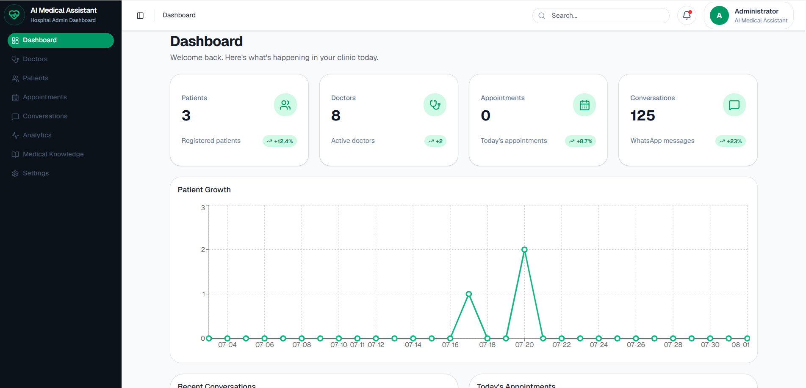
</p>

---

## WhatsApp Conversation

<p align="center">
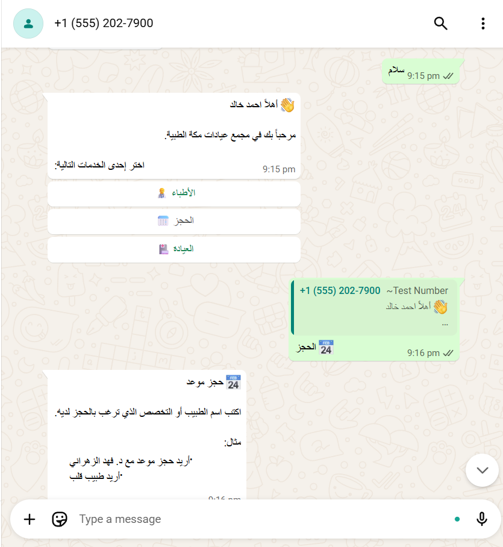
</p>

---

## Patient Management

<p align="center">
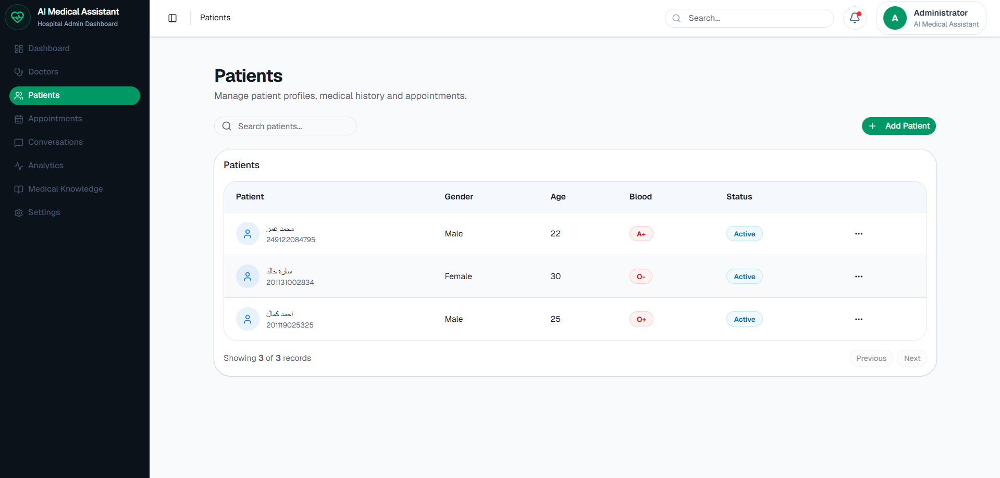
</p>

---

## Analytics

<p align="center">
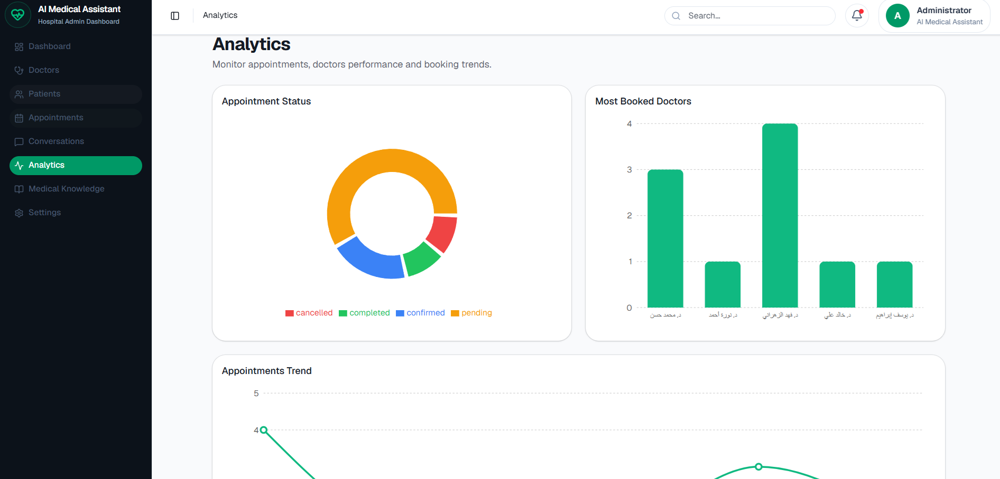
</p>

---

## Medical Knowledge

<p align="center">
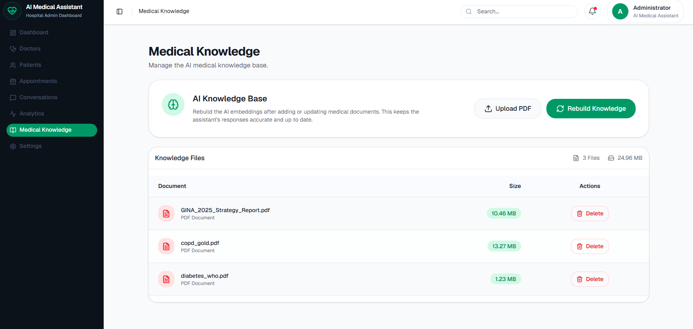
</p>

---

## Database Design

<p align="center">

</p>

---

## System Architecture

<p align="center">

</p>

## Appointment Management

<p align="center">
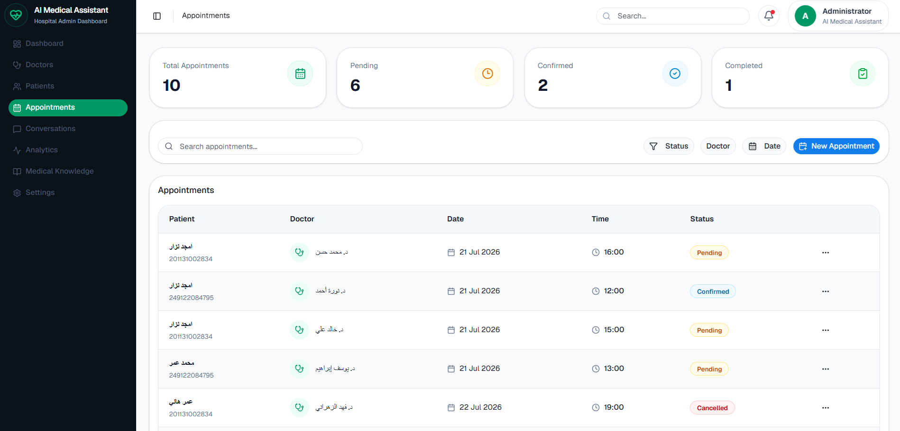
</p>

---

## AI Conversations

<p align="center">
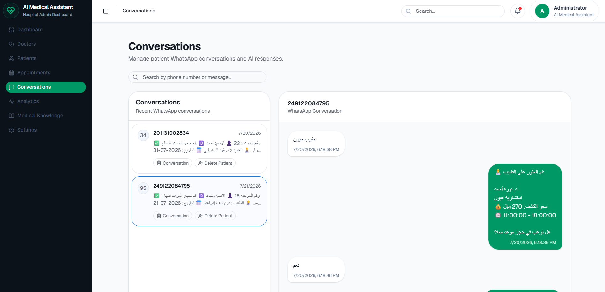
</p>

---

## Settings

<p align="center">
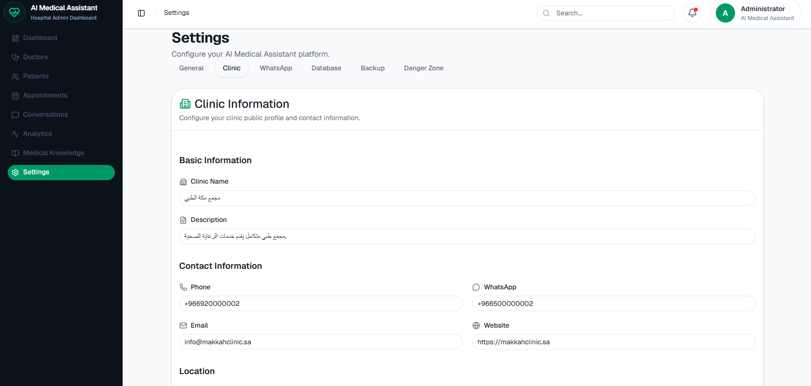
</p>

---

# Current Capabilities

The platform currently supports:

- AI-powered medical conversations

- WhatsApp Business integration

- Medical RAG

- Patient profile extraction

- Conversation history

- Intent classification

- Clinic information retrieval

- Appointment workflow

- Dashboard APIs

- Medical document ingestion

- Semantic document retrieval

- Analytics

- Patient management

- Interactive WhatsApp menus

- Doctor lookup

- Settings management

---

# Design Goals

The system is optimized for:

- Low LLM usage
- Fast response time
- Reliable business workflows
- Scalable architecture
- Easy maintenance
- Production deployment
- High code readability
- Future horizontal scaling

# Roadmap

The platform continues to evolve toward a complete AI-powered healthcare SaaS.

## Phase 1

- ✅ AI Assistant

- ✅ Medical RAG

- ✅ WhatsApp Integration

- ✅ Dashboard

- ✅ Conversation Engine

---

## Phase 2

- Authentication

- Multi-clinic support

- Role-based permissions

- Advanced appointment scheduling

- Doctor availability engine

- Notification service

---

## Phase 3

- Laboratory integration

- Radiology module

- Pharmacy module

- Payment gateway

- Insurance integration

- Calendar synchronization

---

## Phase 4

- Voice messages

- Speech-to-text

- Text-to-speech

- Image understanding

- OCR for medical reports

- Medical document summarization

---

## Phase 5

- Docker deployment

- Kubernetes

- CI/CD pipelines

- Monitoring

- Logging

- Auto scaling

- Cloud deployment

---

# Contributing

Contributions are welcome.

If you would like to improve the project:

1. Fork the repository.

2. Create a new feature branch.

```bash
git checkout -b feature/new-feature
```

3. Commit your changes.

```bash
git commit -m "Add new feature"
```

4. Push the branch.

```bash
git push origin feature/new-feature
```

5. Open a Pull Request.

---

# License

This project is released under the **MIT License**.

Feel free to use, modify, and distribute it according to the license terms.

---

# Author

## Amgad Nazar

AI & Machine Learning Engineer

Data Scientist

Backend Developer

### Portfolio

https://amgadnazar.github.io/

### GitHub

https://github.com/amgadnazar

### LinkedIn

https://linkedin.com/in/amjad-nazar

---

# Support

If you find this project useful, consider giving it a ⭐ on GitHub.

It helps others discover the project and supports future development.

---

<p align="center">

### ⭐ Star the Repository

If you enjoyed this project, don't forget to leave a star!

Made with ❤️ using Python, FastAPI, Google Gemini, Supabase, ChromaDB, React, TypeScript, and the WhatsApp Cloud API.

</p>
